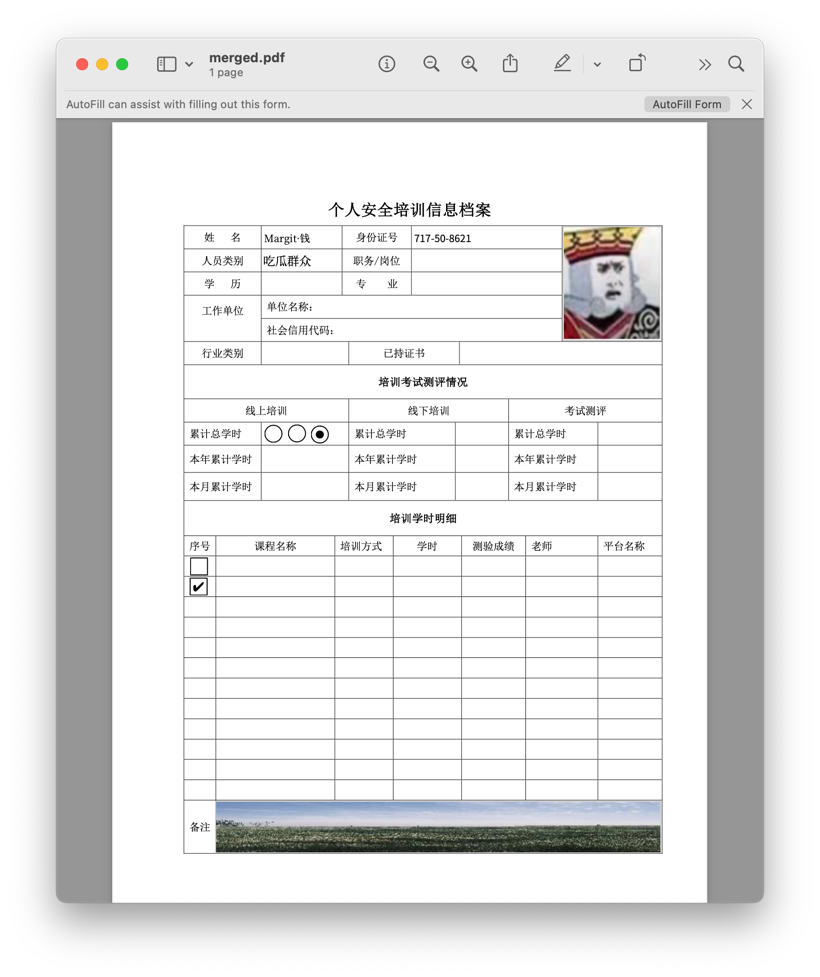

# Motto: motto-pdf-itext8

motto-pdf-itext8 设计用来填充 PDF 文件中的 AcroForm。

这个工具库从模版设计者的角度来说比 [motto-html](https://github.com/ddrpa/motto-html)
更友好，不过表达能力有一些下降。例如渲染不定长列表就会麻烦一些。

## 使用方法

在 `pom.xml` 中添加依赖，最新版本应该是 `cc.ddrpa.motto:motto-pdf-itext8:1.0.0`。

你可以阅读本项目的单元测试了解用法。

### 怎样准备模版

开源软件方面，可以使用 [LibreOffice](https://www.libreoffice.org/download/download-libreoffice/)
直接[创建含有 AcroForm 的 PDF 文件](https://www.maketecheasier.com/create-a-pdf-with-fillable-forms-in-libreoffice/)
。商业软件可以使用 Adobe Acrobat Pro 或福昕 PDF 编辑器。

需要注意的是在某些程序中指定 TextField / TextBox
时设置的字体样式不一定能够顺利保存到输出文件中，例如 [PDF list and combo box fields use wrong font in exported PDF](https://ask.libreoffice.org/t/pdf-list-and-combo-box-fields-use-wrong-font-in-exported-pdf/68532)
，具体原因不明。

motto-pdf-itext8 支持 text field，checkbox，radio button 和 image field。

### 怎样添加字体

静态方法 `cc.ddrpa.motto.pdf.itext.MottoFontAgent#addFont` 接收文件路径注册字体。TrueType® font
collection 文件可通过 `,$FONT_INDEX` 后缀注册集合中指定的字体，规则和 motto-html 是一样的。

```
MottoFontAgent.addFont("font-seems-okay/Noto_Sans_SC/static/NotoSansSC-Regular.ttf");
```

在填充表单的文本内容时，MottoFontAgent 首先会检查 Text Field 声明的字体族是否被注册过，如果没有则会根据要填充的内容自动选择一种字体。

### 怎样填充表单

1. 创建一个 `cc.ddrpa.motto.pdf.itext.DocumentBuilder` 实例；
2. 通过 `loadTemplate` 方法以流的形式载入 PDF 模版；
3. 通过 `merge` 方法传递 `Map<String, Object>` 填充表单：
    - Text Field 可以使用 `java.lang.String`，其他类型会通过 `String.valueOf(value)` 获得字符串
    - Checkbox 类型可以使用 `java.lang.Boolean`
      ，其他类型会通过 `Boolean.parseBoolean(String.valueOf(value))` 获得布尔值
    - Radio Button 类型可以使用 `java.lang.String`，其他类型会通过 `String.valueOf(value)`
      获得字符串，匹配的值会被选中
    - Image Field 可以使用 `java.awt.image.BufferedImage` 或 `byte[]`，字符串会被视为图片文件的路径，其他类型不会被处理
4. `merge` 方法可以被反复调用，但是基于性能考虑，不建议这么做；
5. 通过 `save` 方法保存输出文件；

```
try(FileInputStream fis = new FileInputStream("src/test/resources/lorem.pdf");
   FileOutputStream fos = new FileOutputStream("target/merged.pdf")) {
      BufferedImage avatarImage = ImageIO.read(new File("src/test/resources/avatar.jpeg"));
      DocumentBuilder builder = new DocumentBuilder(fos, new MottoFontAgent());
      builder.loadTemplate(fis)
       .merge(Map.of("Name", faker.name().firstName(),
            "Type","吃瓜群众",
            // load avatar by BufferedImage
            "avatar",avatarImage,
            // load huge image by file path
            "LARGE_PHOTO","src/test/resources/large-photo.jpeg",
            // 单选效果展示
            "Group1","Choice3",
            // 复选框效果展示
            "CheckBoxRow1",false,
            "CheckBoxRow2","True"),
         true)
      .save();
```

`DocumentBuilder` 目前是一次性的，如果你需要批量生成文件，需要从创建 DocumentBuilder 实例重新开始。

## 效果示例



我先使用 Microsoft Word 创建了表格，然后在 Adobe Acrobat Pro 中添加了
AcroForm。这个表格包含了文本框、复选框、单选框和图片。备注一栏照片摄于 [智慧新城草坪公园，衢州市，浙江省，中国](https://j.map.baidu.com/60/weMJ)
，原始照片体积为 15.6MB，生成 PDF 时图片经过了压缩，PDF 文件体积为 143KB。
